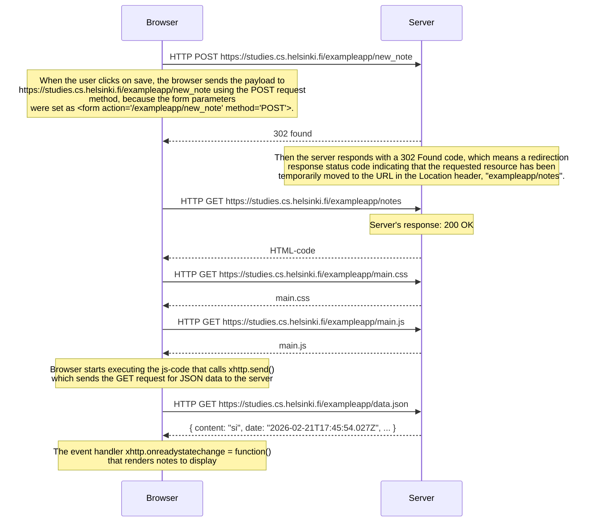

```mermaid
sequenceDiagram
    participant Browser
    participant Server
    Browser->>Server: HTTP POST https://studies.cs.helsinki.fi/exampleapp/new_note
    Note over Browser: When the user clicks on save, the browser sends the payload to <br> https://studies.cs.helsinki.fi/exampleapp/new_note using the POST request <br> method, because the form parameters <br> were set as <form action='/exampleapp/new_note' method='POST'>.
    Server-->>Browser: 302 found 
    Note over Server: Then the server responds with a 302 Found code, which means a redirection <br> response status code indicating that the requested resource has been  <br> temporarily moved to the URL in the Location header, "exampleapp/notes".
    Browser->>Server: HTTP GET https://studies.cs.helsinki.fi/exampleapp/notes
    Note over Server: Server's response: 200 OK
    Server-->>Browser: HTML-code
    Browser->>Server: HTTP GET https://studies.cs.helsinki.fi/exampleapp/main.css
    Server-->>Browser: main.css
    Browser->>Server: HTTP GET https://studies.cs.helsinki.fi/exampleapp/main.js
    Server-->>Browser: main.js
    Note over Browser: Browser starts executing the js-code that calls xhttp.send() <br> which sends the GET request for JSON data to the server
    Browser->>Server: HTTP GET https://studies.cs.helsinki.fi/exampleapp/data.json
    Server-->>Browser: { content: "si", date: "2026-02-21T17:45:54.027Z", ... }
    Note over Browser: The event handler xhttp.onreadystatechange = function() <br> that renders notes to display
```