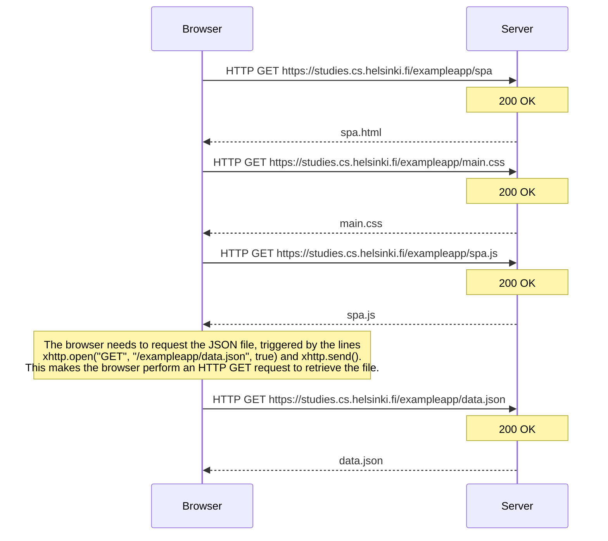

```mermaid
sequenceDiagram
    participant Browser
    participant Server
    Browser->>Server: HTTP GET https://studies.cs.helsinki.fi/exampleapp/spa
    Note over Server: 200 OK
    Server-->>Browser: spa.html
    Browser->>Server: HTTP GET https://studies.cs.helsinki.fi/exampleapp/main.css
    Note over Server: 200 OK
    Server-->>Browser: main.css
    Browser->>Server: HTTP GET https://studies.cs.helsinki.fi/exampleapp/spa.js
    Note over Server: 200 OK
    Server-->>Browser: spa.js
    Note over Browser: The browser needs to request the JSON file, triggered by the lines <br> xhttp.open("GET", "/exampleapp/data.json", true) and xhttp.send(). <br> This makes the browser perform an HTTP GET request to retrieve the file.
    Browser->>Server: HTTP GET https://studies.cs.helsinki.fi/exampleapp/data.json
    Note over Server: 200 OK
    Server-->>Browser: data.json
```