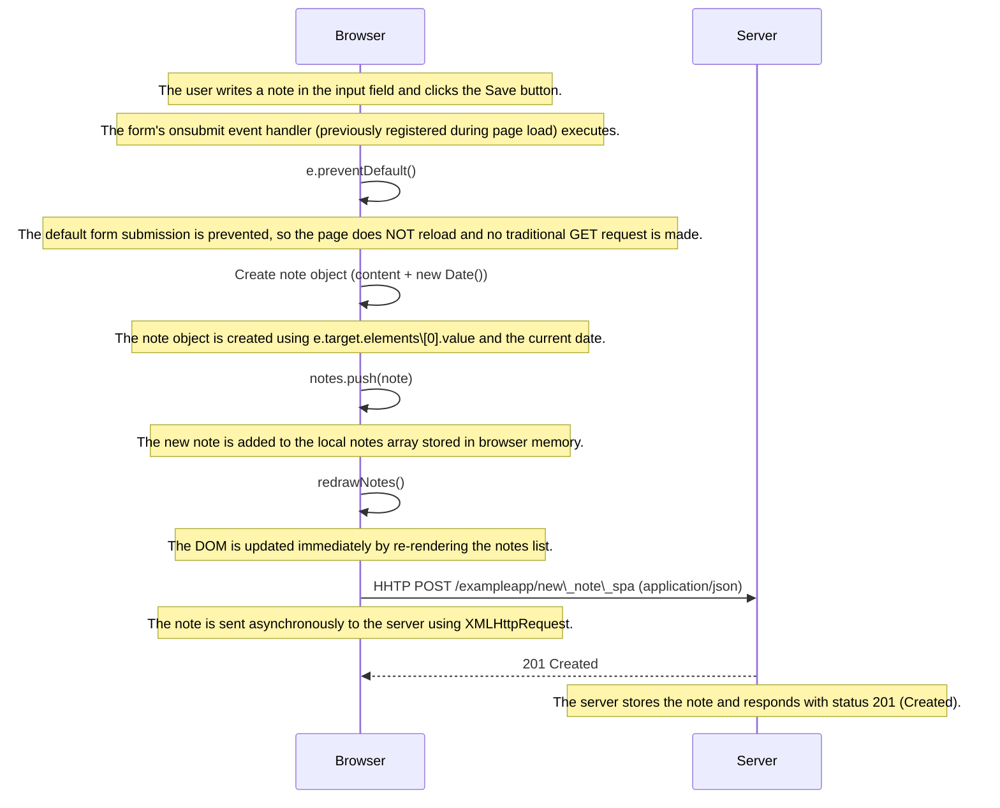

```mermaid
sequenceDiagram
    participant Browser
    participant Server
    Note over Browser: The user writes a note in the input field and clicks the Save button.
    Note over Browser: The form's onsubmit event handler (previously registered during page load) executes.
    Browser->>Browser: e.preventDefault()
    Note over Browser: The default form submission is prevented, so the page does NOT reload and no traditional GET request is made.
    Browser->>Browser: Create note object (content + new Date())
    Note over Browser: The note object is created using e.target.elements\[0].value and the current date.
    Browser->>Browser: notes.push(note)
    Note over Browser: The new note is added to the local notes array stored in browser memory.
    Browser->>Browser: redrawNotes()
    Note over Browser: The DOM is updated immediately by re-rendering the notes list.
    Browser->>Server: HHTP POST /exampleapp/new\_note\_spa (application/json)
    Note over Browser: The note is sent asynchronously to the server using XMLHttpRequest.
    Server-->>Browser: 201 Created
    Note over Server: The server stores the note and responds with status 201 (Created).
```

